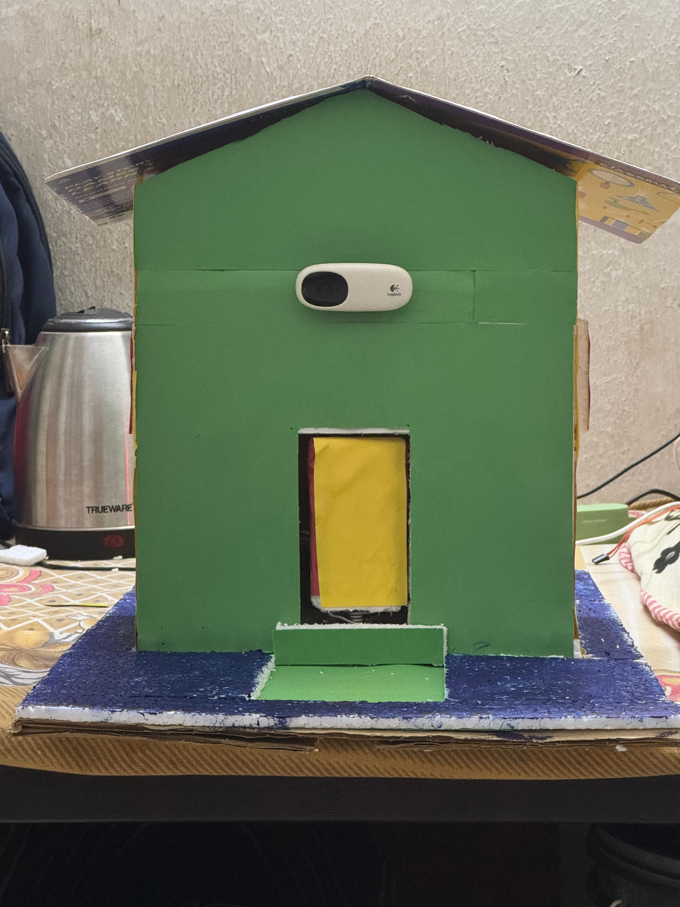

# Smart Door Locking System



This project implements a **Smart Door Locking System** using an ESP32 microcontroller, stepper motors, and face recognition technology. The system provides a secure and automated way to control door access.

---

## Features

- **Face Recognition**: Recognizes authorized users and unlocks the door.
- **Bluetooth Control**: Allows locking and unlocking the door via a mobile device.
- **Attendance System**: Logs the entry time of recognized users.
- **RGB LED Feedback**: Indicates system status:
  - Green: Face recognized or door unlocked.
  - Red: Face unrecognized or door locked.
- **Automatic Locking**: Closes and locks the door after a set interval.

---

## Components Used

### Hardware
- **ESP32**: Microcontroller for Bluetooth communication and motor control.
- **Stepper Motors**:
  - Main motor for opening/closing the door.
  - Lock motor for locking/unlocking the door.
- **RGB LED**: Visual feedback.
- **External Camera**: Captures real-time video for face recognition.
- **Power Supply**: Sufficient to run the motors and ESP32.
- **Door Assembly**: Physical door to attach motors.

### Software
- **Python Libraries**:
  - `cv2` (OpenCV): For video capture and image processing.
  - `face_recognition`: For face detection and encoding.
  - `serial`: For communication with the ESP32.
  - `numpy`: For mathematical operations.
- **Arduino IDE**:
  - For uploading motor control code to the ESP32.

---

## Installation and Setup

### 1. Hardware Setup
1. Connect the stepper motors to the ESP32 using the specified pins in the Arduino code.
2. Attach the RGB LED to the ESP32 as per the pin configuration.
3. Mount the camera near the door for face recognition.
4. Ensure a stable power supply to all components.

### 2. Software Installation
#### Python Environment
1. Install Python 3.8+.
2. Install the required Python libraries:
   ```bash
   pip install opencv-python face_recognition numpy pyserial
